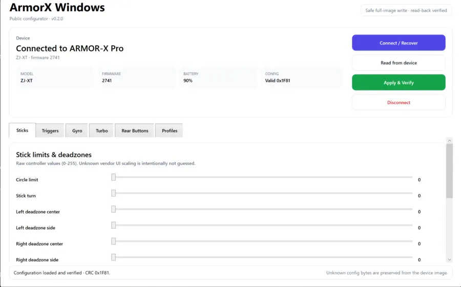
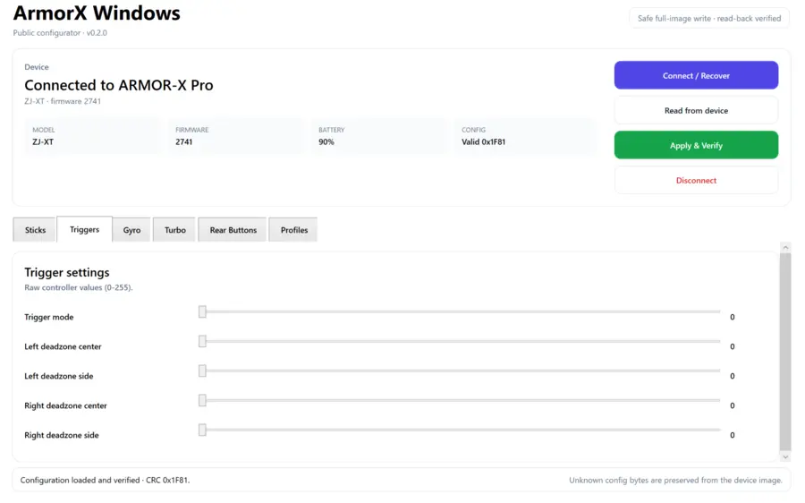
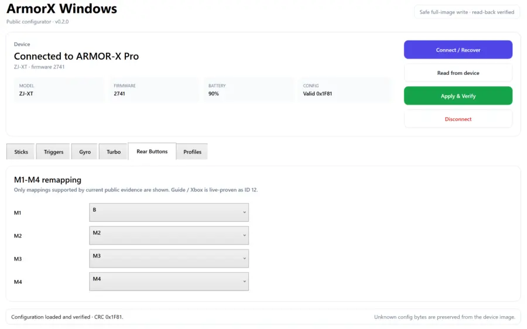
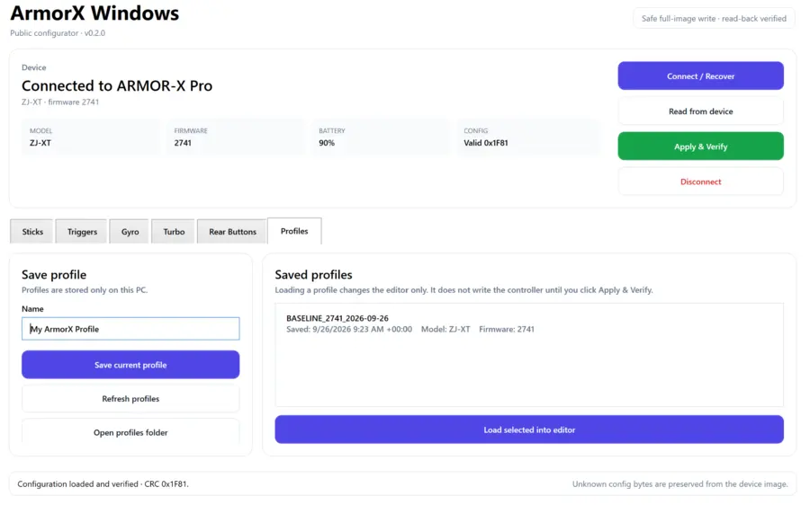

<!--
Keywords: BIGBIG WON, BIGBIGWON, ARMORX Pro, ArmorX Pro, Xbox, Xbox controller,
controller, gamepad, controller remapping, key mapping, controller macro, M1 M2 M3 M4
-->

<div align="center">

# BIGBIG WON ARMORX Pro — Xbox Controller Toolkit

**Open-source configuration, key-mapping, macro, and community tools for the BIGBIG WON ARMORX Pro controller ecosystem.**

Build, inspect, remap, validate, and research **ARMORX Pro** configurations and macros for **Xbox controllers**.


</div>

---

## Overview

> **Latest project release:** **v0.3.0** is the Python/Linux/offline toolkit release with read-only USB discovery, GIP/protocol decoding, capture inspection, diagnostics bundles, and exchange tooling. The latest downloadable Windows configurator remains **v0.2.1**.

**ArmorX Toolkit** is a community-driven interoperability project for the **BIGBIG WON ARMORX Pro**, an accessory for **Xbox controllers**.

The project focuses on:

- decoding and generating ARMORX Pro controller configuration data;
- building and validating controller macros;
- documenting **Xbox controller key mapping** and rear-button remapping;
- documenting config structure, CRC, timing behavior, and unknown fields;
- reproducing read-oriented community/config exchange behavior;
- providing a public Windows BLE configurator alongside the CLI.

> **Unofficial project.** Not affiliated with or endorsed by BIGBIG WON, MOJHON, Microsoft, or Xbox.

## Features

| Area | Current support |
|---|---|
| Config format | 144-byte decoder / builder |
| Integrity | CRC16 validation + regeneration |
| Key mapping | Named Xbox / ARMORX Pro IDs |
| Rear buttons | M1-M4 remapping |
| Macros | Timed steps, chords, cycle modes |
| Config safety | Unknown/reserved bytes preserved when patching |
| Community | Read-oriented config-list and share-code client |
| CLI | Unified `armorx` command |
| Windows GUI | Public Windows 10/11 x64 BLE configurator |
| Research | PROVEN / STRONG EVIDENCE / UNKNOWN evidence levels |
| Quality | Pytest suite + GitHub Actions |

<!-- WINDOWS_GUI_PREVIEW_START -->
## Windows GUI preview

ArmorX Toolkit includes a public Windows 10/11 x64 configurator for ARMOR-X Pro over BLE. The latest Windows release is **v0.2.1**: **[recommended installer](https://github.com/feshinkof-boop/armorx-toolkit/releases/download/v0.2.1/ArmorX-Windows-v0.2.1-Setup.exe)** or **[portable EXE](https://github.com/feshinkof-boop/armorx-toolkit/releases/download/v0.2.1/ArmorX-Windows-v0.2.1.exe)**. It provides normal end-user configuration only; the internal research/capture application and Research Autopilot are separate and are not part of the public GUI.

| Connected + stick settings | Trigger settings |
| --- | --- |
|  |  |
| **Rear button remapping** | **Local profiles** |
|  |  |

The Windows app supports Connect / Recover, configuration read, sticks, triggers, gyro, turbo, M1-M4 remapping, local profiles, and full-image Apply & Verify with read-back verification. **v0.2.1 adds automatic pre-write backups, exact pending-change review, reversible restore, and safer merge-on-fresh-device-image writes.** The screenshots above show the v0.2.0 layout.

<!-- WINDOWS_GUI_PREVIEW_END -->

## ARMORX Pro / Xbox key mapping

| ID | ARMORX Pro / Xbox control | Aliases |
|---:|---|---|
| 0 | **A** | South |
| 1 | **B** | East |
| 2 | **Empty / Clear** | None |
| 3 | **X** | North |
| 4 | **Y** | West |
| 6 | **LB** | Left Bumper |
| 7 | **RB** | Right Bumper |
| 8 | **LT** | Left Trigger |
| 9 | **RT** | Right Trigger |
| 10 | **View** | Select |
| 11 | **Menu** | Start |
| 12 | **Guide** | Xbox / Mode / Home |
| 13 | **L3** | Left Stick Click |
| 14 | **R3** | Right Stick Click |
| 16 | **D-pad Up** | Up |
| 17 | **D-pad Down** | Down |
| 18 | **D-pad Left** | Left |
| 19 | **D-pad Right** | Right |
| 23 | **M1** | Rear button |
| 24 | **M2** | Rear button |
| 25 | **M3** | Rear button |
| 26 | **M4** | Rear button |

The serialized mapping direction is:

```text
mapKeys[source_button_id] = target_button_id
```

Example:

```text
mapKeys[23] = 0
M1 -> A
```

ID 12 is live-proven as Guide/Xbox/Mode. Other IDs remain intentionally unresolved until directly verified; ID 15 is only a provisional Share/Capture/Screenshot candidate. See [docs/keymapping.md](docs/keymapping.md).

## Config format

A controller config is **144 bytes**:

```text
0..1      CRC16
2..3      length (0x0090 / 144)
4..111    controller parameter block
112..143  mapKeys[32]
```

Known fields include trigger settings, left/right stick deadzones, response curves, motion/sensor settings, turbo settings, and button mapping.

Full reference: [docs/config-format.md](docs/config-format.md)

USB/HID research: [docs/usb-protocol.md](docs/usb-protocol.md)

Android/BLE protocol: [docs/android-protocol.md](docs/android-protocol.md)

Windows/Android bridge status: [docs/bridge-status-2026-09-25.md](docs/bridge-status-2026-09-25.md)

Current reverse-engineering status: [docs/research-status-2026-09-28.md](docs/research-status-2026-09-28.md)

Earlier handoff: [docs/research-status-2026-09-25.md](docs/research-status-2026-09-25.md)

Latest controlled live BLE findings: [docs/live-ble-research-2026-09-26.md](docs/live-ble-research-2026-09-26.md)\n\nOfficial-app vs Linux D2 differential: [docs/d2-official-vs-harness-2026-09-27.md](docs/d2-official-vs-harness-2026-09-27.md)

Current hardware/runtime research identifies the tested pair as an **ARMOR-X Pro** with BIGBIG WON **F20 wireless adapter**. The Android path is live-captured: the controller reports mark `ZJ-XT`, uses a vendor BLE service with `FFE1` write / `FFE2` notify, and carries the same `A5` command family as the Windows implementation. D6 is proven as a full 144-byte config read and D7 as a full config write; long payloads use indexed `A4` fragments, and the existing config CRC/key-map model is confirmed against live traffic. A later controlled Windows BLE suite additionally proved that D7 changes are volatile across power loss unless followed by `0E`, decoded the D2 raw-input report family, and live-confirmed key ID 12 as Guide/Xbox/Mode. A subsequent real official-app-vs-harness capture showed that D2 is event-driven: the official app emits no input frames while idle, but repeats valid `A5 12 02` reports at roughly 12 ms cadence while a button is held. ID 15 remains only a provisional Share/Capture/Screenshot candidate. On Windows USB/HID, `413D:2106` still exposes 65-byte reports with logical N=64, but the bounded HID replay remains **LINK-STATE-INCONCLUSIVE**. See the Android/BLE, live-BLE, USB/HID, bridge-status, and handoff documents for evidence and limits.

## Macro format

Macros currently support:

- M1-M4 as trigger buttons;
- tap and long-press activation;
- cycle modes;
- multi-button chords;
- per-step hold duration;
- per-step interval;
- up to 16 steps in the current V41-era model.

Example:

```text
@name Example Combo
@trigger M1
@mode tap
@repeat 200

A       80   50
X      100   60
B+RT   120   70
Y       90  100
```

Full reference: [docs/macro-format.md](docs/macro-format.md)

## Installation

> **Public release scope:** **v0.3.0** is the Python/Linux/offline toolkit release. It adds read-only device discovery, Xbox GIP parsing, A4/A5 protocol tooling, usbmon capture inspection, privacy-sanitized diagnostics bundles, and config/macro exchange envelopes. The current public Windows configurator remains **v0.2.1**; researcher-only firmware analysis, raw private captures, Autopilot workflows, guided experiments, and device-write tooling are not part of the v0.3.0 package.


### Windows 10/11 x64

Use the **[v0.2.1 installer](https://github.com/feshinkof-boop/armorx-toolkit/releases/download/v0.2.1/ArmorX-Windows-v0.2.1-Setup.exe)** (recommended) or the **[portable v0.2.1 EXE](https://github.com/feshinkof-boop/armorx-toolkit/releases/download/v0.2.1/ArmorX-Windows-v0.2.1.exe)**. Turn on ARMOR-X Pro and choose **Connect / Recover**. The app reads the controller's own 144-byte configuration image, preserves unknown bytes, automatically backs up the current device image before writes, and verifies writes by reading all 144 bytes back.

### Python toolkit v0.3.0

```bash
python -m pip install git+https://github.com/feshinkof-boop/armorx-toolkit.git@v0.3.0
armorx --version
```

### Development checkout

```bash
git clone https://github.com/feshinkof-boop/armorx-toolkit.git
cd armorx-toolkit
python -m pip install -e .
```

## Unified CLI

```bash
armorx --help
```

Decode and validate a config:

```bash
armorx config decode config.json
armorx config validate config.json
```

Remap M1 to A and M2 to B:

```bash
armorx config map config.json M1=A M2=B -o patched_config.json
```

Show known mapping IDs:

```bash
armorx config keys
```

Build and inspect a macro:

```bash
armorx macro build examples/example_macro.txt -o macro.json
armorx macro inspect macro.json
```

Preview a community/config request without sending it:

```bash
armorx community list \
  --phone-uuid YOUR_PHONE_ID \
  --dev-uuid YOUR_CONTROLLER_ID \
  --dry-run
```

Full CLI reference: [docs/cli.md](docs/cli.md)

## Legacy scripts

The original standalone scripts are intentionally preserved for direct use and backward compatibility:

```text
tools/armorx_config.py
tools/armorx_macro.py
tools/armorx_community.py
```

The unified `armorx` command is the preferred interface for new users.

## Evidence standard

Protocol claims in this repository are classified as:

- **PROVEN** — directly reproduced or independently confirmed.
- **STRONG EVIDENCE** — multiple signals agree, but one final confirmation is missing.
- **UNKNOWN** — deliberately unresolved.

Unknown bytes and IDs are **not guessed**.

## Repository layout

```text
armorx-toolkit/
├── README.md
├── ROADMAP.md
├── CHANGELOG.md
├── CITATION.cff
├── CONTRIBUTING.md
├── SECURITY.md
├── CODE_OF_CONDUCT.md
├── LICENSE
├── pyproject.toml
├── src/
│   └── armorx/
│       ├── __init__.py
│       ├── __main__.py
│       ├── cli.py
│       ├── config.py
│       ├── macro.py
│       └── community.py
├── docs/
│   ├── cli.md
│   ├── config-format.md
│   ├── keymapping.md
│   ├── macro-format.md
│   ├── community-api.md
│   ├── android-protocol.md
│   ├── bridge-status-2026-09-25.md
│   └── usb-protocol.md
├── examples/
│   └── example_macro.txt
├── tools/
│   ├── armorx_config.py
│   ├── armorx_macro.py
│   └── armorx_community.py
├── tests/
│   ├── test_cli.py
│   ├── test_config.py
│   ├── test_macro.py
│   └── test_community.py
└── .github/
    ├── ISSUE_TEMPLATE/
    ├── PULL_REQUEST_TEMPLATE.md
    └── workflows/
```

## Community

Contributions are welcome, especially:

- controlled config diffs;
- confirmation of unknown key IDs;
- additional firmware behavior;
- anonymized captures from user-owned hardware;
- Xbox controller mapping validation;
- GUI ideas;
- test fixtures;
- documentation improvements.

Please read [CONTRIBUTING.md](CONTRIBUTING.md) and the [Roadmap](ROADMAP.md).

## Search / discovery keywords

**BIGBIG WON** · **BIGBIGWON** · **ARMORX Pro** · **ArmorX Pro** · **Xbox** · **Xbox controller** · **controller** · gamepad · controller remapping · controller macro · key mapping · M1 M2 M3 M4 · controller configuration

## License

MIT — see [LICENSE](LICENSE).
